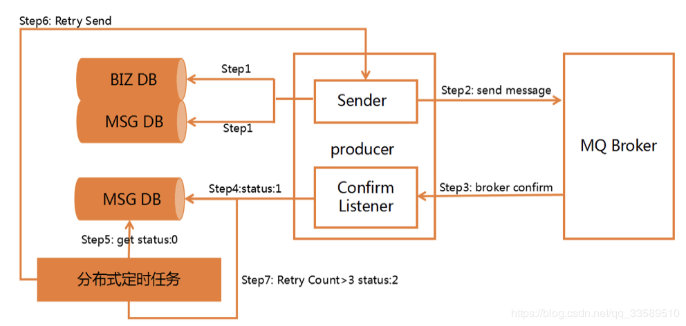

# rabbitmq跟rocketmq应用实例
# MQ实际应用场景

## 如何保证Producer的可靠性投递

 1. 保证消息的成功发出
 2. 保证MQ节点的成功接收
 3. 发送端收到MQ节点(Broker) 确认应答
 4. 完善的消息补偿机制
  
  在实际生产中，很难保障前三点的完全可靠，比如在极端的环境中，生产者发送消息失败了，发送端在接受确认应答时突然发生网络闪断等等情况，很难保障可靠性投递，所以就需要有第四点完善的消息补偿机制。

### 解决方案：
#### 1.方案一:消息信息落库,对消息状态进行打标(常见方案)

